# Geometry Processing Smoothing

> **To get started:** Clone (**do not fork publicly**) this repository
> 
>     git clone --recursive https://github.com/odedstein/fs-2024-csci-599-exercise-5.git
>

## Installation, Layout, and Compilation

See
[introduction](https://github.com/odedstein/fs-2024-csci-599-exercise-1).

## Execution

Once built, you can execute the assignment from inside the `build/` by running
on a given mesh.

    ./subdivision [path to mesh.obj]

## Background

In this exercise we will learn how to produce a high-resolution, smooth surface
from any coarse triangle mesh.
There are multiple reasons why we might want to do this.
For example, we might want to _design_ a coarse mesh by hand, but then render
a high-resolution smooth surface.
This is a very common way to design assets for video games, and the
`penguin`, `fish`, and `spot` meshes you will use in the assignment today were
all created in that way.
Another reason to produce a high-resolution smooth surface from a low-resolution
coarse surface are performance reasons.
Computing a physical simulation, or any geometric operation, on a low-resolution
surface is computationally cheap.
If the surface is very coarse, these operations might even be computable in
real time.
These coarse results can then be upsampled to a smooth surface for display.

## Upsampling

How does one turn a mesh with a certain number of triangles into a mesh with
more triangles?
Ideally, we want to upsample our meshes such that
- the new vertices we create have 6 neighbors (degree 6); and
- we don't create any small angles.
We want most vertices in a mesh to have degree 6, since this corresponds to a
natural tiling of the plane with equilateral triangles (which is advantageous
for a variety of applications).
We also do not want to create any angles that are smaller than the ones already
present in the mesh, since small angles, for example, make deformation or
finite element discretization difficult.

A simple way to add more triangles while fulfilling above conditions is to
_upsample_ each triangle of the mesh by replacing every triangle with
four triangles as in the following picture:

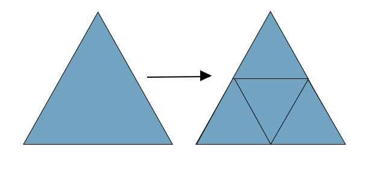

We replace each triangle with four triangles by subdividing each edge into two.
One new vertex is inserted in the middle of each edge, and then the three new
vertices are connected within each triangle, forming four sub-triangles.

It is important to notice at this point that the position of the new vertices
is a linear function oh the old vertex position.
Let $v_1, v_2$ be two vertices on an old edge.
Then the new vertex on that edge, $v^*$, is given by

$$
v^* = \frac{1}{2}(v_1 + v_2) \; .
$$

This means that, if $V_0$ is the vertex list of the old mesh $(V_0,F_0)$,
there must exist
a matrix $S$ such that the vertex list of the new mesh, $(V_1,F_1)$, is given by

$$
V_1 = S V_0 \; .
$$

The exact entries of $S$ depend on how you assign indices to the new vertices in
your face-list $F_1$.
There are many ways to do this.
One way of assigning new indices is as follows:
- Set the first `n` new vertices to be the same as the old ones.
- After that, assign a unique index to every edge using face adjacency information. Remember which faces the edge belongs to, and whether it belongs to two faces (interior edge) or only one (boundary edge).
- This new unique index, when added to `n`, are the indices of the new vertices.

Using the knowledge of which faces every new vertex belongs to, you can now
also easily construct the sparse matrix $S$:
Its first `n` rows are just the identity matrix, and then its last rows
feature `0.5` at the columns corresponding to the old vertex indices that make
up the face the new vertex has been placed in.

This is how different upsampling levels look like on a basic fish mesh:

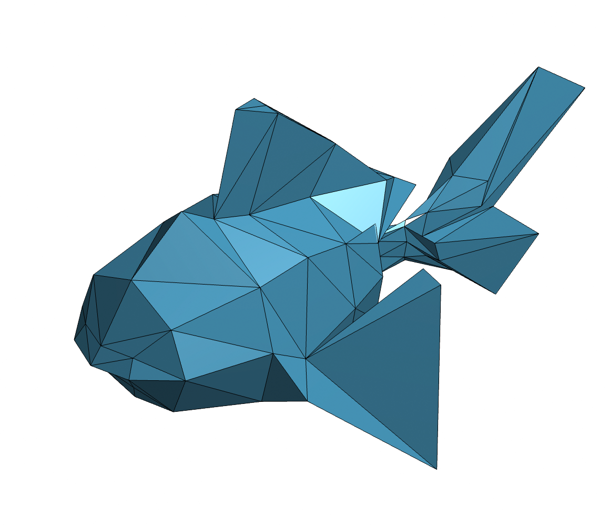
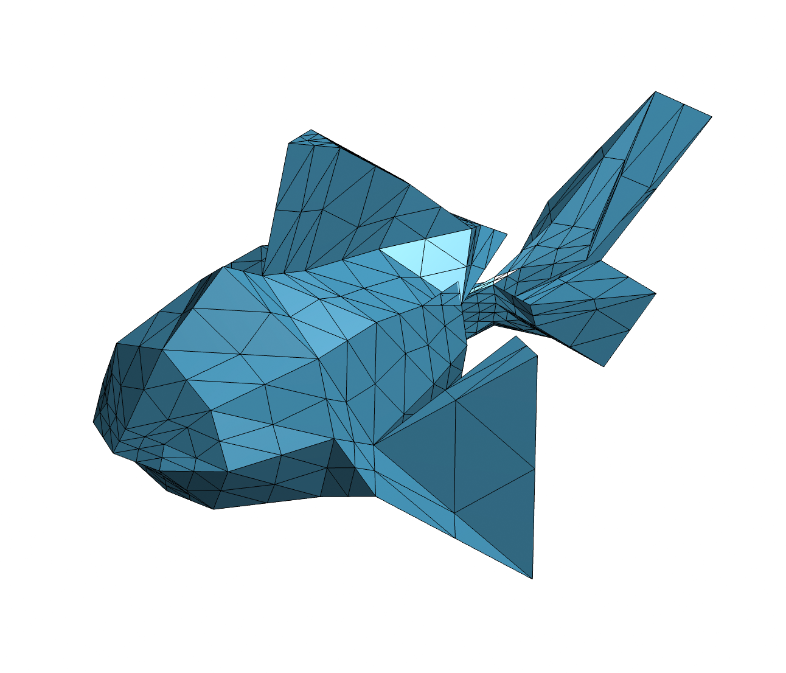
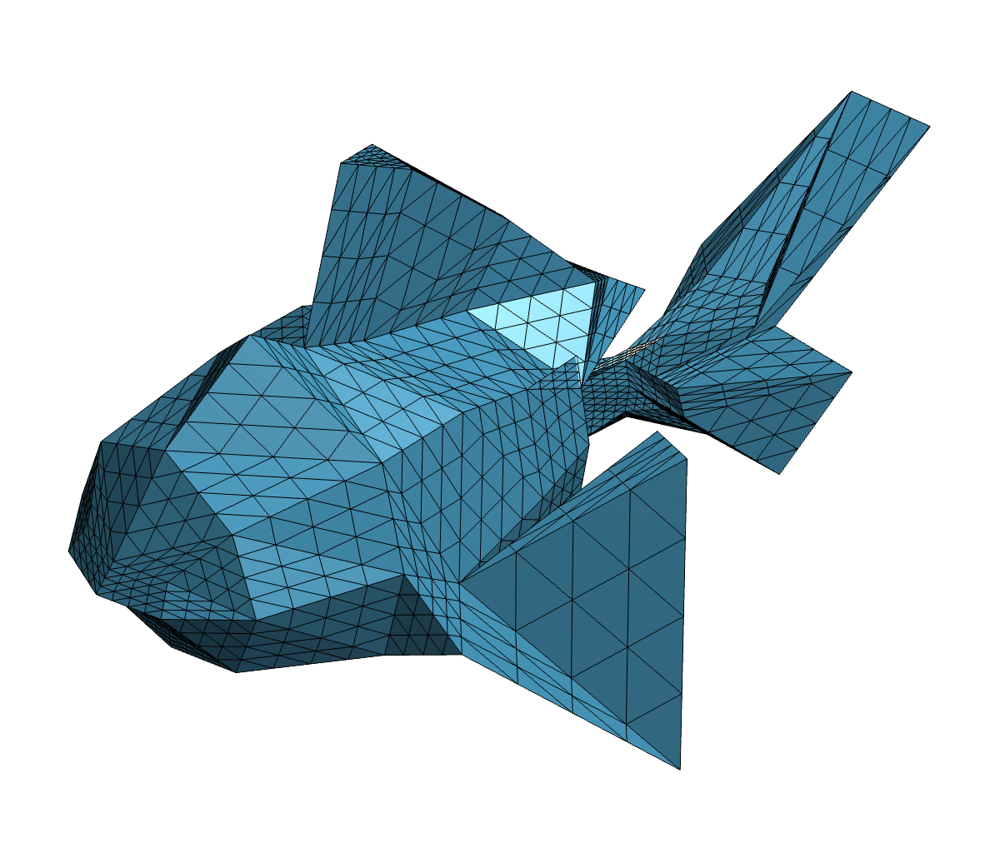
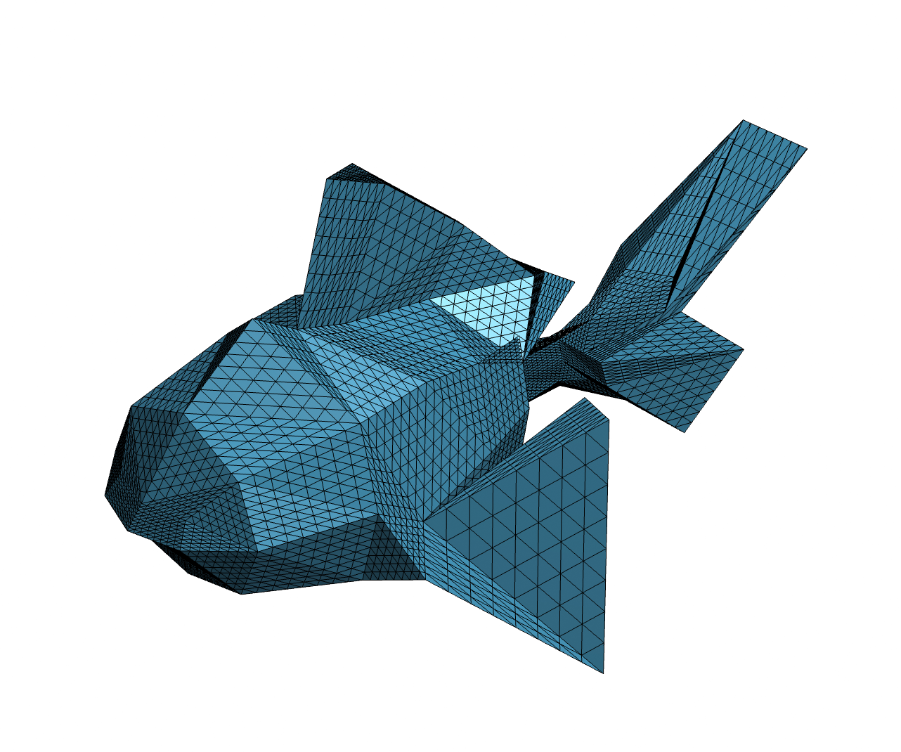

## Subdivision

The problem with upsampling is that the resulting surface is just as jagged
and nonsmooth as before, just with more triangles.
What we want, is to get a _smooth_ high-resolution surface.
In order to do this, after inserting the new upsampled vertices, we need to
move the old vertices.
The method to move old vertices after each update is called
[_Loop subdivision_]((https://www.microsoft.com/en-us/research/wp-content/uploads/2016/02/thesis-10.pdf))
(after Charles Loop, not because it involves a loop in code).

If you have ever evaluated Bézier curves, you might be familiar with upsampling
a one-dimensional _curve_ and then moving the old vertices.
One way to construct Bézier curves is
[De Casteljau's algorithm](https://en.wikipedia.org/wiki/De_Casteljau%27s_algorithm):
New vertices are added to the curve in the middle of each old segment, and then
the old vertices are moved.
Loop's algorithm can be understood as de Casteljau's algorithm for triangle
meshes.
In fact, Loop subdivision surfaces are partially two-dimensional Bézier
spline surfaces (see [this article](http://www.cs.cmu.edu/afs/cs/academic/class/15456-f15/RelatedWork/Loop-by-Stam.pdf) for more details).

For convenience sake, we divide all vertices on the upsampled surfaces into
red vertices (old vertices) and green vertices (new vertices):

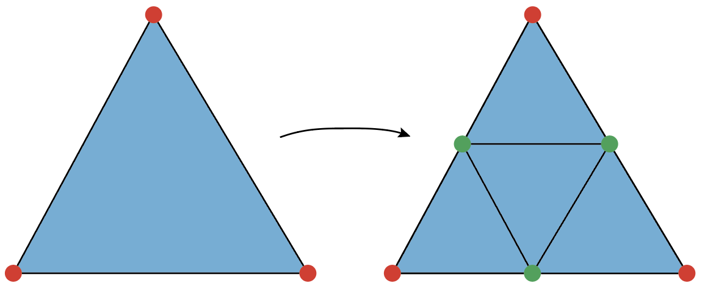

The green vertices are no longer inserted just in the middle of each edge,
as with upsampling.
We now also take into account the vertices from across the face:

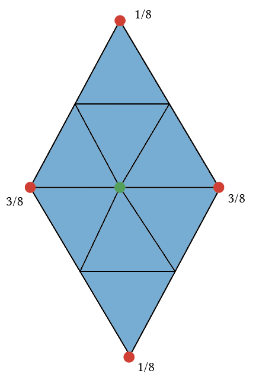

If the green vertex is a _boundary vertex_, a different rule applies:

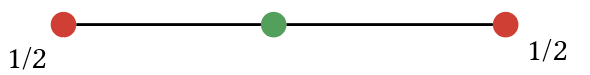

Now that the green vertices have been placed, the old red vertices need to be
moved.
This is important:
If we never move the old vertices our surface would be merely upsampled - lots
of triangles, but still jagged and nonsmooth.
We move interior red vertices (red vertices that are _not_ on the boundary)
to a weighted sum of the vertex and its red neighbors: 

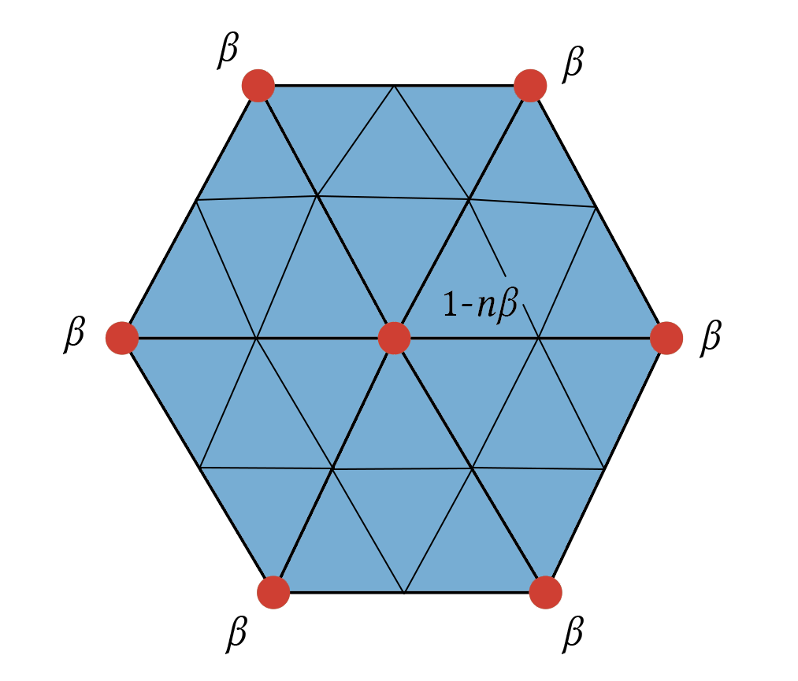

What is the parameter β?
We need to pick β so that the sum of all vertices is equal to $1$, and so that
$\beta = \frac{1}{16}$ for $n=6$ (this is so that the Loop subdivision
surface is a spline surface on regular vertices with six neighbors).
There are multiple valid choices.
Loop's original choice is

$$
\beta = \frac{1}{n} \left( \frac{5}{8} - \left( \frac{3}{8} + \frac{1}{4} \cos \frac{2 \pi}{n}  \right)^2 \right)
\; .
$$

But this is not the only valid choice.
Another popular choice, used, for example, by [Matt Fisher](https://graphics.stanford.edu/~mdfisher/subdivision.html),
is [Warren's coefficient](https://www.cs.princeton.edu/courses/archive/fall06/cos526/lectures/subdivision.pdf):

$$
\beta = \begin{cases}
  \frac{3}{8 n} & n > 3 \\
  \frac{3}{16} & n = 3
\end{cases}
\; .
$$

Feel free to use whichever coefficient you feel like in your own implementation.

It remains to move the old boundary vertices.
For this, we employ this simple rule:

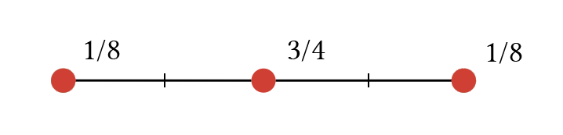

Using this simple rule, we can get smooth, high-resolution surfaces from coarse
meshes (often called _control meshes_ or _control cages_):

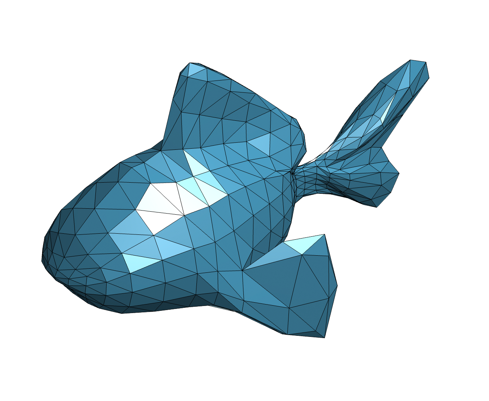
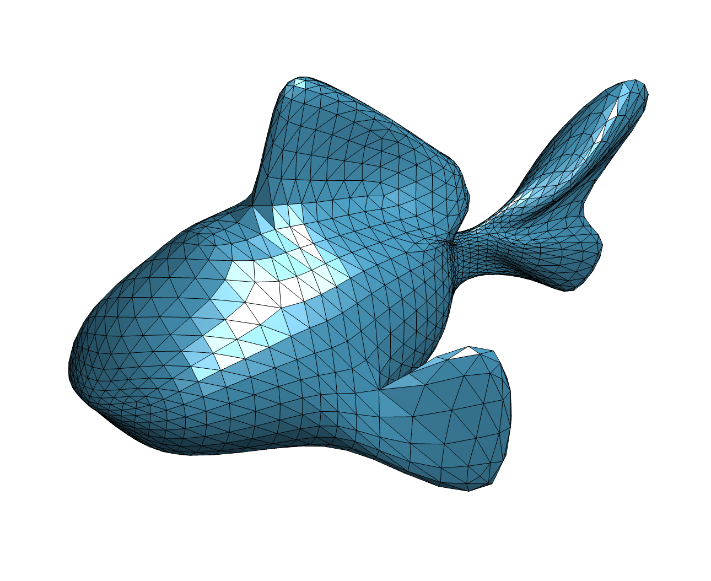
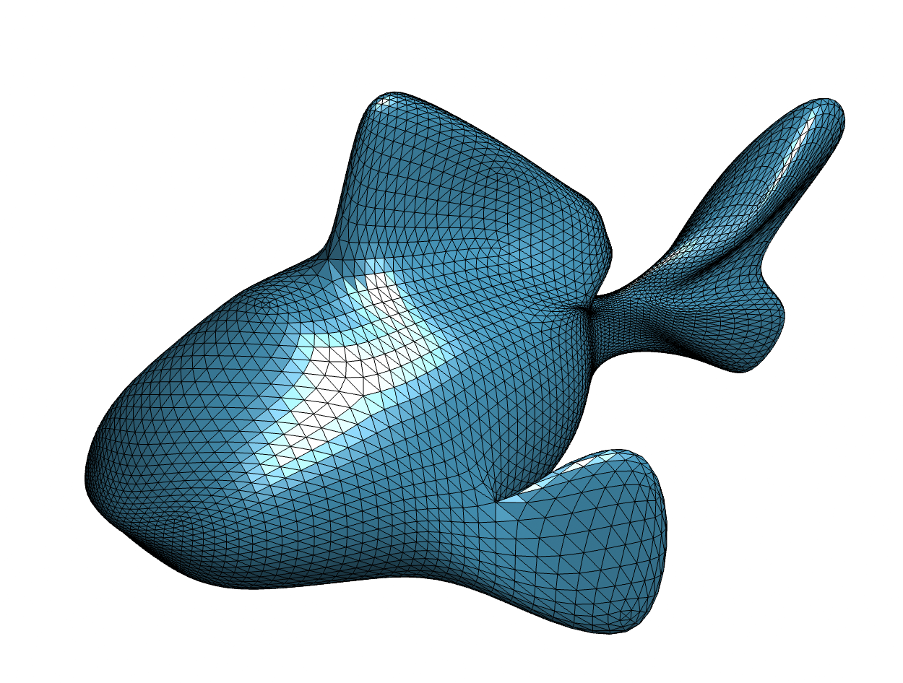

If we repeated this operation infinitely many times, we would get a perfectly
smooth surface:

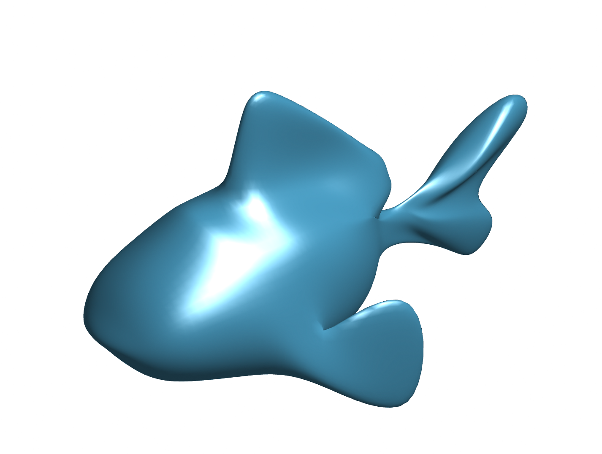

In practice, it is enough to subdivide a few times so that, in combination
with smooth shading, the surface appears infinitely smooth.
In a shader or a renderer, the surface can be subdivided locally to just the
right resolution neded for display.

## Tasks

### Read the original

Read [Loop's original masters thesis](https://www.microsoft.com/en-us/research/wp-content/uploads/2016/02/thesis-10.pdf) where he introduces Loop subdivision.

### White list

  - `igl::unique_edge_map`
  - `igl::triangle_triangle_adjacency`
  - `igl::adjacency_list`

### Black list

  - `igl::upsample`
  - `igl::loop`

### `src/upsample.cpp`

Upsample the mesh so that each triangle is replaced with four new triangles,
as described above.
You must only return a list of the new faces `newF`, as well as a sparse matrix
`S`:
Since the upsampled vertex coordinates are a linear combination of the old ones,
the upsampled vertices should be equal to `newV = S * V`.

### `src/loop.cpp`

Loop subdivide the mesh once, as described above.
You must only return a list of the new faces `newF`, as well as a sparse matrix
`S`:
Since the Loop subdivided vertex coordinates are a linear combination of the
old ones, the subdivided vertices should be equal to `newV = S * V`.

> Hint: Get your face list from your `upsample` function - it should be exactly the same one.

## Acknowledgements

[Matt Fisher's succinct Loop subdivision tutorial](https://graphics.stanford.edu/~mdfisher/subdivision.html) as well as [Oded Stein's MATLAB subdivision tutorial](https://github.com/odedstein/gp-matlab-tutorial/blob/main/011_subdivision/011_subdivision.md) served as inspiration and sources for this exercise.

